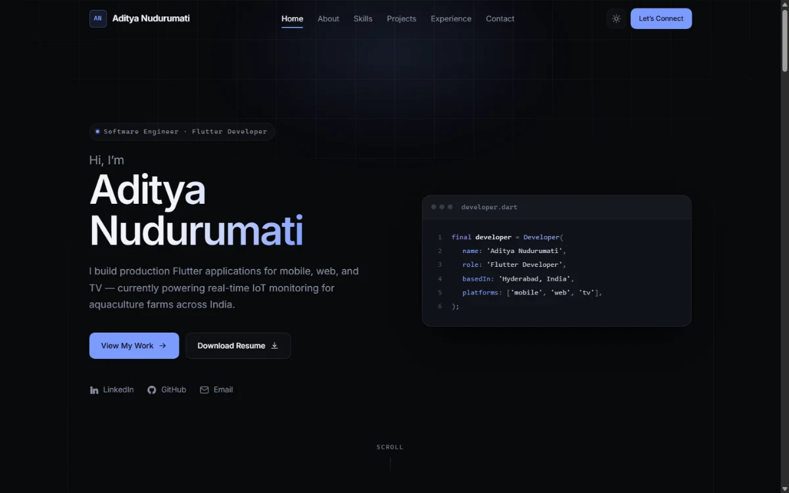

# Aditya Nudurumati — Portfolio

Personal portfolio site for **Aditya Nudurumati**, a Software Engineer and Flutter
developer based in Hyderabad, India. It presents my experience, the production
applications I've shipped, my stack and my education on a single page, plus a
separate `/notes/` page publishing the long-form study notes I write.

**Live:** [adityanudurumati.com](https://adityanudurumati.com)  ·  Built with
React, Vite and hand-written CSS — no UI framework, ~77 KB gzipped.



---

## Tech stack

| Layer | Choice | Why |
| --- | --- | --- |
| Framework | React 19 | Component reuse without a heavy runtime |
| Build | Vite 8 (multi-page) | One HTML entry per page — no router dependency |
| Routing | Real URLs, no router | `/notes/` is a document, so it survives a refresh on any static host |
| Language | JavaScript (ESM) | No build-step complexity beyond Vite |
| Styling | Hand-written CSS | Design tokens + one stylesheet per component |
| Icons | Inline SVG | Avoids an icon-library dependency |
| Linting | oxlint | Fast, zero-config |

**Runtime dependencies: `react` and `react-dom`.** No CSS framework, no
component library, no animation library, no icon package.

---

## Features

- **Two pages** — a single-scroll home page (hero, about, skills, projects,
  experience, education, contact) and `/notes/`, a standalone study-notes
  archive that stays out of the home-page scroll
- **Notes archive** — subject tracks of long-form PDFs, grouped into collapsible
  modules, each document viewable in the browser or downloadable
- **Light and dark themes** — follows the OS preference, overridable by a
  toggle, persisted to `localStorage`, and applied before first paint so there
  is no flash of the wrong theme
- **Responsive from 320 px upwards** — layouts are redesigned per breakpoint
  rather than scaled down, and verified to produce no horizontal overflow
- **Accessible** — semantic landmarks, a single `h1`, skip link, visible focus
  states, keyboard-operable mobile menu with focus management and `Escape` to
  close, `aria-current` on the active nav item, and meaningful `alt` text
- **Motion-aware** — scroll reveals and hover transitions are disabled entirely
  under `prefers-reduced-motion: reduce`
- **Optimised images** — WebP at two widths with `srcset`, lazy loading, and
  explicit dimensions to prevent layout shift
- **Scroll-spy navigation** — a single `IntersectionObserver` highlights the
  section in view, with no scroll listeners
- **SEO** — Open Graph and Twitter cards, canonical URL, `robots.txt`,
  `sitemap.xml` and JSON-LD `Person` structured data
- **Content separated from presentation** — all copy lives in `src/data/`, so
  updating the site never means touching a component

---

## Running locally

**Prerequisites:** Node.js 18 or newer, and npm.

```bash
# 1. Clone
git clone https://github.com/AdityaNudurumati/aditya-nuduramati-portfolio.git
cd aditya-nuduramati-portfolio

# 2. Install dependencies
npm install

# 3. Start the dev server → http://localhost:5173
npm run dev
```

### Available scripts

| Command | Description |
| --- | --- |
| `npm run dev` | Start the Vite dev server with hot reload |
| `npm run build` | Production build into `dist/` |
| `npm run preview` | Serve the production build locally |
| `npm run lint` | Run oxlint over the source |

> **Windows / PowerShell note:** if `npm run dev` fails with
> *"running scripts is disabled on this system"*, either use `npm.cmd run dev`
> or enable script execution once with
> `Set-ExecutionPolicy -Scope CurrentUser -ExecutionPolicy RemoteSigned`.

---

## Project structure

```
index.html           home page entry
notes/index.html     notes page entry — own title, canonical and OG tags
public/              favicon, OG image, robots.txt, sitemap.xml, resume PDF
└── notes/flutter/   the published notes PDFs, served as-is
src/
├── assets/          project screenshots and profile photo (WebP)
├── components/      one component per section
│   ├── layout/      SiteShell — skip link, navbar, <main>, footer
│   └── ui/          shared primitives (Section shell, Icon set)
├── data/            all site content — edit here, not in components
├── hooks/           useTheme, useScrollSpy, useReveal
├── pages/           HomePage, NotesPage — one per HTML entry
├── index.css        design tokens, reset, buttons/cards/tags
├── main.jsx         home page entry point
└── notes.jsx        notes page entry point
```

Each component has a sibling `.css` file. `src/index.css` is imported first in
each entry point so component styles can override the base layer.

**Adding a page** means adding an `<entry>/index.html`, a `src/<entry>.jsx` that
mounts a page component, and the entry to `rollupOptions.input` in
`vite.config.js`. Pages wrap their content in `SiteShell`, which owns the
landmarks so the accessibility scaffolding cannot drift between them; a page
passes `homeHref="/"` so the navbar's section anchors resolve back to the home
page.

---

## Editing the content

Everything on the page is driven by plain objects in `src/data/`:

| File | Contents |
| --- | --- |
| `profile.js` | Name, role, location, email, social links, résumé path, photo |
| `about.js` | About paragraphs and the highlight facts |
| `skills.js` | Skill groups and their tags |
| `projects.js` | Project cards — name, description, stack, links, images |
| `experience.js` | Roles, dates and responsibilities |
| `education.js` | Qualifications and certifications |
| `navigation.js` | Navbar links — home-page sections and page links |
| `notes.js` | Notes tracks, modules and the documents in each |

Adding a notes track means dropping the PDFs into `public/notes/<track>/`, then
setting that track's `status` to `'published'` in `notes.js` and filling in its
`basePath` and `modules`. No component changes.

Sections hide themselves when their data array is empty, and project cards omit
buttons for links that aren't set — so nothing on the page ever advertises
something that doesn't exist.

---

## License

© 2026 Aditya Nudurumati. All rights reserved.

The code is public so it can be read and learned from. Please don't republish
the site as your own — and the written content, résumé, photograph and project
screenshots are not covered by any reuse permission.
